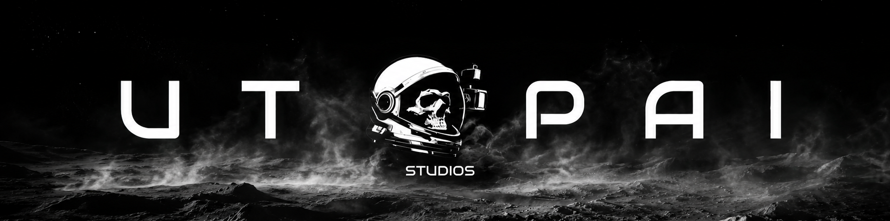

<div align="center">

# pai-pro

**The local AI filmmaking canvas for your coding agent.**

[](https://www.utopaistudios.com/)
[](https://x.com/UtopaiStudios)

<a href="https://www.utopaistudios.com/">
  
</a>

</div>

Filmmaking skills + a React Flow canvas + an embedded `claude` terminal. Write a screenplay, design characters, generate clips, lay them out on a timeline — all from inside Claude Code (or Codex / Cursor / Gemini CLI; the skills are agent-agnostic). Local-first: project files live on disk, generated media mirrors alongside, nothing leaves your machine except the actual generation calls. Built by [Utopai Studios](https://www.utopaistudios.com/).

## Key capabilities

- **Filmmaking skills** in standard SKILL.md format — image, video, voice, script, groups, notes, summary. ([Reference →](docs/skills.md))
- **A React Flow canvas** with character / location / image / video / note nodes, grouped scenes, mention-pill references.
- **A Timeline tab** that plays your shots in sequence — drag clips onto the reel, reorder, scrub.
- **Embedded `claude` terminal** in the right rail. Real PTY, tmux-style, auto-resumes the project session.
- **Per-project memory** — every project owns its `workflow.json` and asset folder; agent context follows when you switch.
- **Bring-your-own coding agent** — Claude Code today; Codex / Cursor / Gemini CLI compatible via the same SKILL.md format. ([Compatibility →](docs/agents.md))

## Quick start

**With Docker (the on-ramp):**

```bash
git clone https://github.com/Utopai-Research/pai-pro.git ~/pai-pro
cd ~/pai-pro && cp .env.example .env       # add your PAI_KEY
docker compose up --build
```

Open <http://localhost:7588>.

**Or paste this block into your coding agent** — Claude Code / Codex / Cursor / Gemini CLI all consume it the same way (host mode, Vite HMR for live reload):

```bash
git clone https://github.com/Utopai-Research/pai-pro.git ~/pai-pro && cd ~/pai-pro
./setup && npm --prefix server install && npm --prefix web install
cp .env.example .env && ./start.sh
```

Open <http://localhost:7443>. In the embedded terminal, `/login` once and you're driving.

> See [docs/docker.md](docs/docker.md) for the multi-stage build internals, Windows / WSL2 notes, and what the image contains. [docs/development.md](docs/development.md) covers the host-mode Vite HMR loop and contributor setup.

## API key

One key, **PAI_KEY**, drives every capability — image, video, voice, and reference-asset uploads all route through PAI Lite. Get a key (and watch your live balance) at <https://pai-pro.utopaistudios.com/>. CLIs only fire when you explicitly ask for media; chat suggestions don't burn credits.

## Resources

- 📚 [Documentation](docs/) — Docker setup, development, architecture, agents, skills, FAQ
- 🎬 [Skills reference](skills/) — the `SKILL.md` files that drive the agent
- 🔑 [PAI developer platform](https://pai-pro.utopaistudios.com/) — get keys, watch balance
- 💬 [Discussions](https://github.com/Utopai-Research/pai-pro/discussions) — questions, ideas, show & tell
- 🐛 [Issues](https://github.com/Utopai-Research/pai-pro/issues) — bug reports only

## License

Released under the [PAI PRO Sustainable Use License](LICENSE.md) by [Utopai Studios](https://www.utopaistudios.com/).

- **Source available** — visible source code
- **Self-hostable** — runs entirely on your machine
- **Skill-extensible** — write your own filmmaking skills

[Enterprise licenses](mailto:enterprise@utopaistudios.com) available for commercial use beyond the personal-and-internal-business scope.

## Contributing

Found a bug 🐛 or have a feature idea ✨? See [CONTRIBUTING.md](CONTRIBUTING.md) for the contribution guide, the proprietary-skills carve-out, and the CLA flow.
