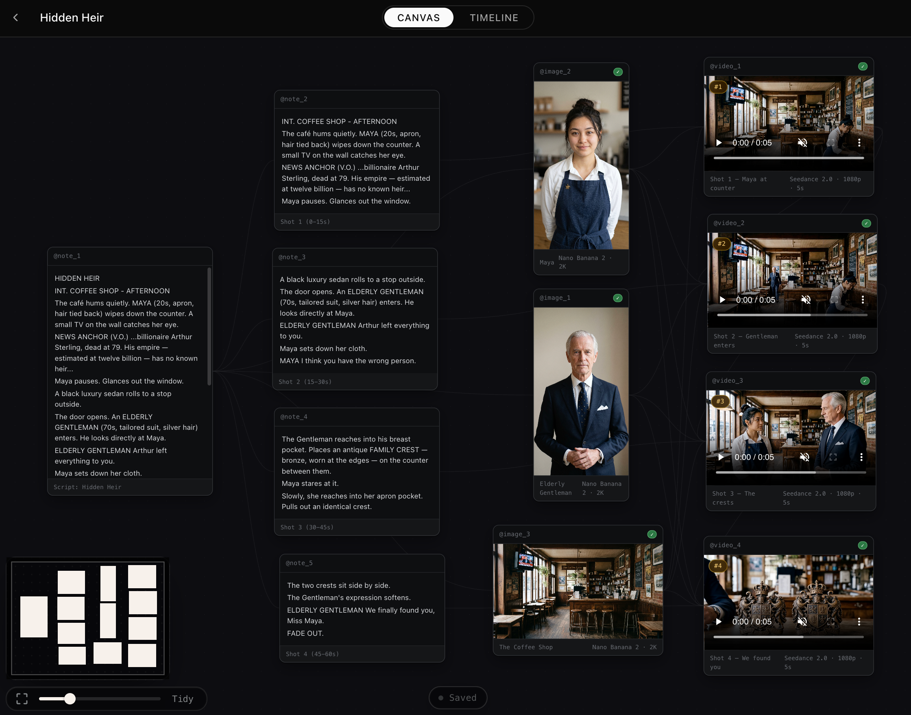

# PAI-Pro

**由代码 Agent 驱动的本地 AI 电影制作工作室。**

[English](README.md)

## PAI-Pro 是什么？

PAI-Pro 是一个本地部署的 AI 电影制作工作区，围绕四件事构建：

- **你自己的 [Claude Code][claude-code-url] 或 [Codex][codex-url]**：本地项目管理、持久上下文管理，可自我定制的skills和workflows。([安装与Agent](docs/setup.md))
- **端到端电影制作技能**：覆盖剧本的设计、图像/视频的生成与修改、以及声音的生成，支持灵活的自我skill定义。([skills](docs/skills.md))
- **可视化画布和时间线**：用于设计场景、管理素材、安排镜头，并组织更大的制作项目。
- **一个故事媒体 API 服务**：统一处理图像、视频和声音，因此制作流程不需要为每一个模型分别接入不同供应商。([API 服务详情](docs/api_service.md))

## 快速开始

使用 Claude Code 或 Codex 帮你安装 PAI-Pro。把下面这段发给你的 Agent：

> Clone [`https://github.com/Utopai-Research/pai-pro`](https://github.com/Utopai-Research/pai-pro), read the setup docs in [README.md](README.md) and [docs/setup.md](docs/setup.md), then install PAI-Pro for my current agent. Ask me for my `PAI_KEY`, use Docker unless I ask for local development, and start the app when setup is complete.

| 选择 | 命令 |
| --- | --- |
| **[Claude Code][claude-code-url]** | Docker: `docker compose up --build` 本地开发：如果端口被占用，先运行 `./scripts/stop.sh`；然后运行 `./scripts/setup --agent claude` 和 `./scripts/start.sh` |
| **[Codex][codex-url]** | Docker: `PAI_DEFAULT_AGENT_ID=codex docker compose up --build` 本地开发：如果端口被占用，先运行 `./scripts/stop.sh`；然后运行 `./scripts/setup --agent codex` 和 `PAI_DEFAULT_AGENT_ID=codex ./scripts/start.sh` |

Docker 模式打开 <http://localhost:7588>，本地模式打开 <http://localhost:7443>。

## API 服务

`PAI_KEY` 为每个制作项目提供一个统一服务，覆盖 image、image pro、video 和 voice，不需要为每一步分别配置不同供应商的 key。使用 <a href="https://pai-pro.utopaistudios.com/keys" target="_blank" rel="noopener noreferrer">PAI Pro Developer Platform</a> 管理 keys、tasks、balance 和 credits。它也通过 asset preupload 支持更宽松的视频审核。付费生成会先进入草稿阶段；BYOK 和精确 JSON payload 请见 [API Service](docs/api_service.md)。

| 能力 | 质量 | 时间 | 参考素材数量 | 预估价格 |
|---|---|---|---|---|
| [`generate_image`](server/cli/generate_image.js) | Great | ~10-30s | 16 imgs | $0.07 / $0.10 / $0.15 for 1K / 2K / 4K |
| [`generate_image_pro`](server/cli/generate_image_pro.js) | Best | ~3-6 min | 32 imgs | $0.26 / $0.45 / $0.77 for 1K / 2K / 4K |
| [`generate_video`](server/cli/generate_video.js) | Best | ~3-6 min | 9 imgs / 3 vids / 3 auds | $0.08/s / $0.20/s / $0.44/s for 480p / 720p / 1080p |
| [`generate_voice`](server/cli/generate_voice.js) | Good | ~5-15s | N/A | $0.01 per 500 input characters, rounded up |

## 资源

- [Discord][discord-url] — 问题、想法、支持和作品分享
- [API Service](docs/api_service.md) — Developer Platform 说明、BYOK 对照和精确媒体 JSON payload
- [Skills reference](docs/skills.md) — 电影制作技能如何路由 Agent 请求
- [Setup and agents](docs/setup.md) — Docker/host 模式、Claude/Codex、端口、认证和权限
- [Architecture](docs/architecture.md) — viewer、CLI、canvas 和项目文件结构
- [FAQ](docs/faq.md) — 常见安装和生成问题
- [Issues](https://github.com/Utopai-Research/pai-pro/issues) — 仅用于 bug 报告
- [Contributing](CONTRIBUTING.md) — 贡献指南、专有技能说明和 CLA 流程

## License

PAI-Pro 使用 [PAI PRO Sustainable Use License](LICENSE.md) 发布，允许个人使用、非商业研究和内部商业使用。PAI-Pro Skills 或企业指定源码/Skills 的商业使用需要单独协议；如需企业授权，请联系 [enterprise@utopaistudios.com](mailto:enterprise@utopaistudios.com)。

[discord-url]: https://discord.gg/CfjRGGwK
[claude-code-url]: https://code.claude.com/docs/en/overview
[codex-url]: https://developers.openai.com/codex/cli
